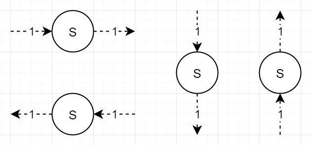
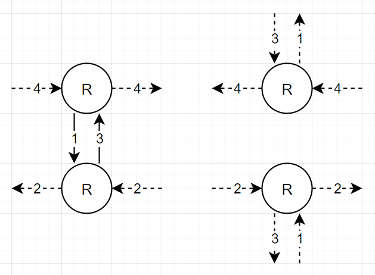

# 빛의 경로 사이클

## [링크]
https://school.programmers.co.kr/learn/courses/30/lessons/86052

## [문제]
#### [문제 설명]
각 칸마다 S, L, 또는 R가 써져 있는 격자가 있습니다. 당신은 이 격자에서 빛을 쏘고자 합니다. 이 격자의 각 칸에는 다음과 같은 특이한 성질이 있습니다.
* 빛이 "S"가 써진 칸에 도달한 경우, 직진합니다.
* 빛이 "L"이 써진 칸에 도달한 경우, 좌회전을 합니다.
* 빛이 "R"이 써진 칸에 도달한 경우, 우회전을 합니다.
* 빛이 격자의 끝을 넘어갈 경우, 반대쪽 끝으로 다시 돌아옵니다. 예를 들어, 빛이 1행에서 행이 줄어드는 방향으로 이동할 경우, 같은 열의 반대쪽 끝 행으로 다시 돌아옵니다.

당신은 이 격자 내에서 빛이 이동할 수 있는 경로 사이클이 몇 개 있고, 각 사이클의 길이가 얼마인지 알고 싶습니다. 경로 사이클이란, 빛이 이동하는 순환 경로를 의미합니다.

예를 들어, 다음 그림은 격자 ["SL","LR"]에서 1행 1열에서 2행 1열 방향으로 빛을 쏠 경우, 해당 빛이 이동하는 경로 사이클을 표현한 것입니다.

이 격자에는 길이가 16인 사이클 1개가 있으며, 다른 사이클은 존재하지 않습니다.

격자의 정보를 나타내는 1차원 문자열 배열 grid가 매개변수로 주어집니다.
주어진 격자를 통해 만들어지는 빛의 경로 사이클의 모든 길이들을 배열에 담아 오름차순으로 정렬하여 return 하도록 solution 함수를 완성해주세요.

#### [입력 형식]
+ 1 ≤ grid의 길이 ≤ 500
	* 1 ≤ grid의 각 문자열의 길이 ≤ 500
	* grid의 모든 문자열의 길이는 서로 같습니다.
	* grid의 모든 문자열은 'L', 'R', 'S'로 이루어져 있습니다.

#### [입출력 예]
|grid|result|
|:---:|:---:|
|["SL","LR"]|[16]|
|["S"]|[1,1,1,1]|
|["R","R"]|[4,4]|

#### [입출력 예제]
입출력 예 #1
* 문제 예시와 같습니다.
* 길이가 16인 사이클이 하나 존재하므로(다른 사이클은 없습니다.), [16]을 return 해야 합니다.

입출력 예 #2
* 주어진 격자를 통해 만들 수 있는 사이클들은 다음 그림과 같습니다.

* 4개의 사이클의 길이가 모두 1이므로, [1,1,1,1]을 return 해야 합니다.

입출력 예 #3
* 주어진 격자를 통해 만들 수 있는 사이클들은 다음 그림과 같습니다.

* 2개의 사이클의 길이가 모두 4이므로, [4,4]를 return 해야 합니다.