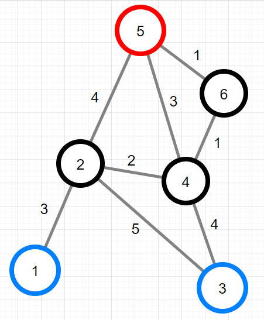
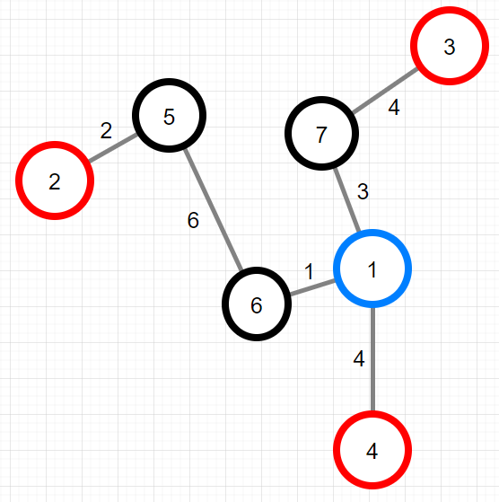
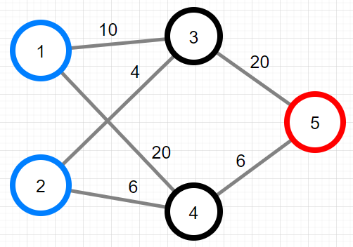

# 등산코스 정하기

## [링크]
https://school.programmers.co.kr/learn/courses/30/lessons/118669

## [문제]
#### [문제 설명]
XX산은 n개의 지점으로 이루어져 있습니다. 각 지점은 1부터 n까지 번호가 붙어있으며, 출입구, 쉼터, 혹은 산봉우리입니다. 각 지점은 양방향 통행이 가능한 등산로로 연결되어 있으며, 서로 다른 지점을 이동할 때 이 등산로를 이용해야 합니다. 이때, 등산로별로 이동하는데 일정 시간이 소요됩니다.

등산코스는 방문할 지점 번호들을 순서대로 나열하여 표현할 수 있습니다.
예를 들어 1-2-3-2-1 으로 표현하는 등산코스는 1번지점에서 출발하여 2번, 3번, 2번, 1번 지점을 순서대로 방문한다는 뜻입니다.
등산코스를 따라 이동하는 중 쉼터 혹은 산봉우리를 방문할 때마다 휴식을 취할 수 있으며, 휴식 없이 이동해야 하는 시간 중 가장 긴 시간을 해당 등산코스의 intensity라고 부르기로 합니다.

당신은 XX산의 출입구 중 한 곳에서 출발하여 산봉우리 중 한 곳만 방문한 뒤 다시 원래의 출입구로 돌아오는 등산코스를 정하려고 합니다. 다시 말해, 등산코스에서 출입구는 처음과 끝에 한 번씩, 산봉우리는 한 번만 포함되어야 합니다.
당신은 이러한 규칙을 지키면서 intensity가 최소가 되도록 등산코스를 정하려고 합니다.

다음은 XX산의 지점과 등산로를 그림으로 표현한 예시입니다.

* 위 그림에서 원에 적힌 숫자는 지점의 번호를 나타내며, 1, 3번 지점에 출입구, 5번 지점에 산봉우리가 있습니다. 각 선분은 등산로를 나타내며, 각 선분에 적힌 수는 이동 시간을 나타냅니다. 예를 들어 1번 지점에서 2번 지점으로 이동할 때는 3시간이 소요됩니다.
위의 예시에서 1-2-5-4-3 과 같은 등산코스는 처음 출발한 원래의 출입구로 돌아오지 않기 때문에 잘못된 등산코스입니다. 또한 1-2-5-6-4-3-2-1 과 같은 등산코스는 코스의 처음과 끝 외에 3번 출입구를 방문하기 때문에 잘못된 등산코스입니다.

등산코스를 3-2-5-4-3 과 같이 정했을 때의 이동경로를 그림으로 나타내면 아래와 같습니다.

이때, 휴식 없이 이동해야 하는 시간 중 가장 긴 시간은 5시간입니다. 따라서 이 등산코스의 intensity는 5입니다.

등산코스를 1-2-4-5-6-4-2-1 과 같이 정했을 때의 이동경로를 그림으로 나타내면 아래와 같습니다.

이때, 휴식 없이 이동해야 하는 시간 중 가장 긴 시간은 3시간입니다. 따라서 이 등산코스의 intensity는 3이며, 이 보다 intensity가 낮은 등산코스는 없습니다.

XX산의 지점 수 n, 각 등산로의 정보를 담은 2차원 정수 배열 paths, 출입구들의 번호가 담긴 정수 배열 gates, 산봉우리들의 번호가 담긴 정수 배열 summits가 매개변수로 주어집니다. 이때, intensity가 최소가 되는 등산코스에 포함된 산봉우리 번호와 intensity의 최솟값을 차례대로 정수 배열에 담아 return 하도록 solution 함수를 완성해주세요. intensity가 최소가 되는 등산코스가 여러 개라면 그중 산봉우리의 번호가 가장 낮은 등산코스를 선택합니다.

#### [입력 형식]
+ 1 ≤ grid의 길이 ≤ 500
	* 1 ≤ grid의 각 문자열의 길이 ≤ 500
	* grid의 모든 문자열의 길이는 서로 같습니다.
	* grid의 모든 문자열은 'L', 'R', 'S'로 이루어져 있습니다.

+ 2 ≤ n ≤ 50,000
+ n - 1 ≤ paths의 길이 ≤ 200,000
+ paths의 원소는 [i, j, w] 형태입니다.
	* i번 지점과 j번 지점을 연결하는 등산로가 있다는 뜻입니다.
	* w는 두 지점 사이를 이동하는 데 걸리는 시간입니다.
	* 1 ≤ i < j ≤ n
	* 1 ≤ w ≤ 10,000,000
	* 서로 다른 두 지점을 직접 연결하는 등산로는 최대 1개입니다.
+ 1 ≤ gates의 길이 ≤ n
	* 1 ≤ gates의 원소 ≤ n
	* gates의 원소는 해당 지점이 출입구임을 나타냅니다.
+ 1 ≤ summits의 길이 ≤ n
	* 1 ≤ summits의 원소 ≤ n
	* summits의 원소는 해당 지점이 산봉우리임을 나타냅니다.
+ 출입구이면서 동시에 산봉우리인 지점은 없습니다.
+ gates와 summits에 등장하지 않은 지점은 모두 쉼터입니다.
+ 임의의 두 지점 사이에 이동 가능한 경로가 항상 존재합니다.
+ return 하는 배열은 [산봉우리의 번호, intensity의 최솟값] 순서여야 합니다.

#### [입출력 예]
|n|paths|gates|summits|result|
|:---:|:---:|:---:|:---:|:---:|
|6|[[1, 2, 3], [2, 3, 5], [2, 4, 2], [2, 5, 4], [3, 4, 4], [4, 5, 3], [4, 6, 1], [5, 6, 1]]|[1, 3]|[5]|[5, 3]|
|7|[[1, 4, 4], [1, 6, 1], [1, 7, 3], [2, 5, 2], [3, 7, 4], [5, 6, 6]]|[1]|[2, 3, 4]|[3, 4]|
|7|[[1, 2, 5], [1, 4, 1], [2, 3, 1], [2, 6, 7], [4, 5, 1], [5, 6, 1], [6, 7, 1]]|[3, 7]|[1, 5]|[5, 1]|
|5|[[1, 3, 10], [1, 4, 20], [2, 3, 4], [2, 4, 6], [3, 5, 20], [4, 5, 6]]|[1, 2]|[5]|[5, 6]|

#### [입출력 예제]
입출력 예 #1
* 문제 예시와 같습니다. 등산코스의 intensity가 최소가 되는 산봉우리 번호는 5, intensity의 최솟값은 3이므로 [5, 3]을 return 해야 합니다.

입출력 예 #2
* XX산의 지점과 등산로를 그림으로 표현하면 아래와 같습니다.

* 가능한 intensity의 최솟값은 4이며, intensity가 4가 되는 등산코스는 1-4-1 과 1-7-3-7-1 이 있습니다. intensity가 최소가 되는 등산코스가 여러 개이므로 둘 중 산봉우리의 번호가 낮은 1-7-3-7-1 을 선택합니다. 따라서 [3, 4]를 return 해야 합니다.

입출력 예 #3
* XX산의 지점과 등산로를 그림으로 표현하면 아래와 같습니다.

* 가능한 intensity의 최솟값은 1이며, 그때의 등산코스는 7-6-5-6-7 입니다. 따라서 [5, 1]를 return 해야 합니다.

	* 7-6-5-4-1-4-5-6-7 과 같은 등산코스는 산봉우리를 여러 번 방문하기 때문에 잘못된 등산코스입니다.

입출력 예 #4
* XX산의 지점과 등산로를 그림으로 표현하면 아래와 같습니다.

* 가능한 intensity의 최솟값은 6, 그때의 등산코스는 2-4-5-4-2 입니다. 따라서 [5, 6]을 return 해야 합니다.