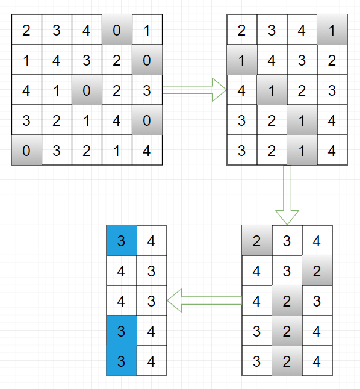

## [문제]
#### [문제 설명]
어떤 학급에서 아래의 규칙으로 반장 투표를 실시합니다.

학급 구성원이 N명이라면, 학생들에게는 부터 N-1까지 출석번호가 부여됩니다.

학급 구성원 모두가 반장 후보입니다.

각자 선호하는 반장 후보가 순서대로 정해져 있습니다.

학급 구성원 모두는 현재까지 탈락하지 않은 후보들 중, 가장 선호도가 높은 후보에게 투표합니다.

반수 이상을 득표한 후보가 나오면 그 사람을 당선자로 결정하고, 투표를 중단합니다.

5-1. 학급 구성원의 수 N이 짝수라면 반수는 N/2, N이 홀수라면 반수는 (N+1)/2라고 정의합니다.

5-2. 반수를 득표한 후보가 2명이라면, 출석번호가 가장 큰 사람을 당선자로 결정합니다.

반수 이상을 득표한 후보가 없으면, 가장 적게 득표한 후보를 탈락시키고, 재투표를 실시합니다.(4.로 갑니다)

6-1. 가장 적게 득표한 후보가 여러 명이라면, 출석번호가 가장 작은 사람을 탈락시킵니다.

아래는 5명으로 구성된 학급에서, 총 4회의 투표를 실시하여 3번 학생이 반장으로 선출되는 과정을 그림으로 나타낸 것입니다.

회색으로 표시된 번호가 각 투표에서 탈락된 학생의 출석번호, 파란색으로 표시된 번호가 반장으로 당선된 학생의 출석번호입니다.

0번 학생이 선호하는 후보를 순서대로 나타내면 [2, 3, 4, 0, 1],

1번 학생이 선호하는 후보를 순서대로 나타내면 [1, 4, 3, 2, 0],

2번 학생이 선호하는 후보를 순서대로 나타내면 [4, 1, 0, 2, 3],

3번 학생이 선호하는 후보를 순서대로 나타내면 [3, 2, 1, 4, 0],

4번 학생이 선호하는 후보를 순서대로 나타내면 [0, 3, 2, 1, 4] 입니다.

자기 자신도 선호하는 후보 순서에 반드시 포함되어야 합니다.

1차 투표에서는 모든 학생이 1표씩 받게 됩니다. 출석번호가 가장 작은 0번 학생이 탈락하게 됩니다.

2차 투표에서는 1번 학생이 1표, 2번 학생이 1표, 3번 학생이 2표, 4번 학생이 1표를 받게 됩니다. 1표를 받은 학생들 중, 출석번호가 가장 작은 1번 학생이 탈락하게 됩니다.

3차 투표에서는 2번 학생이 1표, 3번 학생이 2표, 4번 학생이 2표를 받게 됩니다. 득표수가 가장 적은 2번 학생이 탈락하게 됩니다.

4차 투표에서는 3번 학생이 3표, 4번 학생이 2표를 받게 됩니다. 반수(3) 이상을 득표한 3번 학생이 반장으로 당선되며, 투표를 종료합니다.

좋아하는 후보들을 순서대로 담은 2차원 정수 배열 orders가 매개변수로 주어집니다.
이때, 반장이 선출될 때까지 필요한 투표의 횟수와 반장으로 당선된 학생의 출석번호를 차례대로 배열에 담아서 return 하도록 solution 함수를 완성해주세요.

#### [제한 조건]
* orders는 행과 열의 길이가 같은 2차원 정수 배열입니다.
* orders의 행의 길이는 2 이상 1,000 이하입니다.

* orders의 행의 길이를 N이라고 하면, orders의 모든 행은 0부터 N-1까지의 정수를 정확히 1개씩 담고 있습니다.
* orders[i][j]는 i번 학생이 j번째로 선호하는 학생의 출석번호입니다.

* 가장 선호하는 순위를 0번째라고 가정합니다.

#### [입출력 예]
|orders|result|
|:---:|:---:|
|[[2, 3, 4, 0, 1], [1, 4, 3, 2, 0], [ 4, 1, 0, 2, 3], [ 3, 2, 1, 4, 0], [ 0, 3, 2, 1, 4]]|[4, 3]|
|[[2, 1, 0, 3], [3, 2, 0, 1], [3, 0 ,2, 1], [2, 3, 0, 1]]|[1, 3]|

## [입출력 예 설명]
입출력 예 #1
* 문제 예시와 같습니다. 총 4번의 투표가 진행되었고, 3번 학생이 반장으로 당선되었으므로, 배열에 4,3을 차례대로 담아서 return 합니다.

입출력 예 #2
* 1차 투표에서 2, 3번 학생이 모두 2표씩 받게 됩니다. 두 학생 모두 반수(2)를 득표했는데, 출석번호가 더 큰 3번 학생이 반장으로 당선됩니다. 따라서, 배열에 1,3을 차례대로 담아서 return 합니다.
